# 4.5 NAT

- NAT란? (Network Address Translation)

  - IP 주소를 변환하는 기술
  - 이를 통해
    - 부족한 글로벌 IP 주소 절약
    - 동일 네트워크 주소 가진 시스템 간 통신 등 IP 환경 내 다양한 문제 해결 가능
  - NAT 테이블에 따라 동작

  **넓은 의미의 NAT**

  <table style="width:100%; border-spacing: 10px; border-collapse: separate;" border=1;>
    <tr>
        <th style="border: 0; text-align: center;" colspan="8">넓은 의미의 NAT</th>
    </tr>
    <tr>
        <td style="text-align: center;" colspan="1" rowspan="2">정적 NAT (좁은 의미의 NAT) (1:1 NAT)</td>
        <td style="text-align: center;">동적 NAT</td>
        <td style="text-align: center;">NAPT (IP 마스커레이드) (PAT)</td>
        <td style="text-align: center;" colspan="1" rowspan="2">Twice NAT</td>
        <td style="text-align: center;" colspan="1" rowspan="2">쌍방향 NAT (Two-way NAT)</td>
        <td style="text-align: center;" colspan="1" rowspan="2">수신지 NAT (부하 분산 기술)</td>
    </tr>
    <tr>
        <td style="text-align: center;" colspan="2">CGNAT (Career Grade NAT)</td>
    </tr>
  </table>

## 4.5.1 정적 NAT

- 내부와 외부의 IP 주소를 1:1로 묶어서 변환.
- `static NAT`, `1:1 NAT`, `좁은 의미의 NAT`라고 하기도 함.

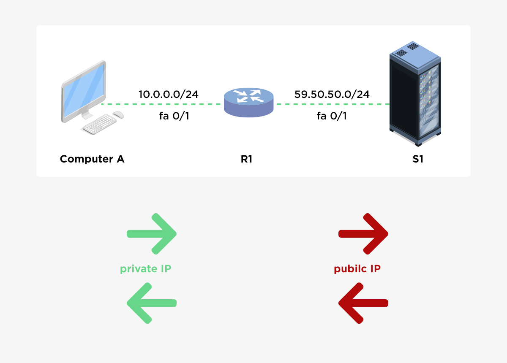
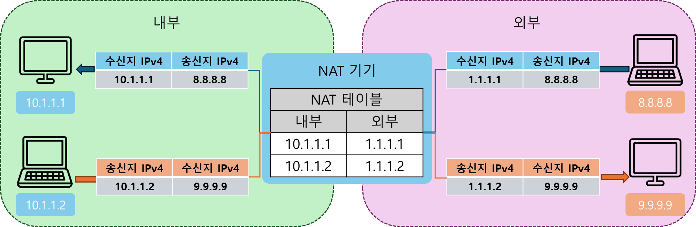
포트 변환 x. 하나의 사설 ip 주소가 하나의 공인 ip 주소와 연결.

## 4.5.2 NAPT (Network Address Port Translation)

- 내부와 외부의 IP 주소를 n:1로 연결해서변환
- `IP 주소`, `PAT(Port Address Translation)` 라고 하기도 함
  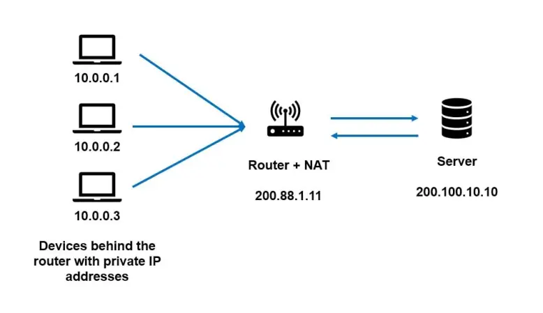
  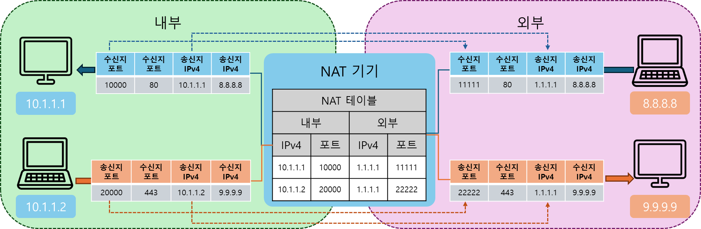

포트 변환 가능. 여러 개의 사설 ip 주소를 하나의 공인 ip 주소로 연결.

## 4.5.3 CGNAT (Carrier Grade NAT)

- 구조 자체는 NAPT와 같지만, 사용자 가정이나 기업이 아닌 ISP(인터넷 서비스 공급자, Internet Service Provider) 들이 수행.
  - KT, SKB, LG U+ 등
- 즉. 사용자 개인의 공인 IP가 아닌 공유된 공인 IP를 사용하게 됨.
  - 물론 추가로 지불 후 개인 공인 IP 소유 가능.
    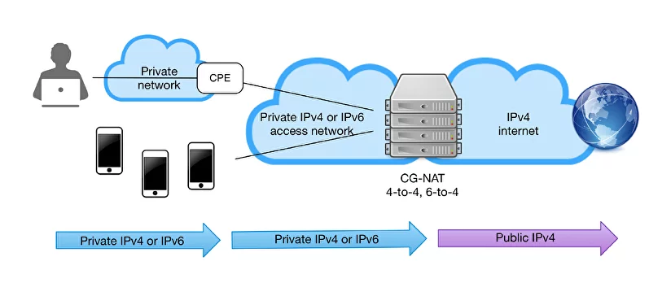
    - CPE (Customer Premise Equipment) : 가입자 댁내장치. 사용자가 계약한 ISP의 네트워크에 접속하기 위해 이용하는 통신기기. 모뎀이라고 불리기도 함

### 포트 할당 기능

  
<strong>가입자에 할당할 수 있는 포트번호는 한 IP 주소당 64512( 65535 - 1024 + 1)개.</strong>

  <h4>5장에서 자세히 다룰 내용</h4>
  <ul>
    <li>시스템 예약포트 (0 ~ 1023)</li>
    <li>동적/임시 포트 (1024 ~ 65535)</li>
  </ul>

IP 주소의 물리적 한계를 극복하기 위해 여러 **IP 주소 테이블**이라는 형태로 n:n으로 연결한다.

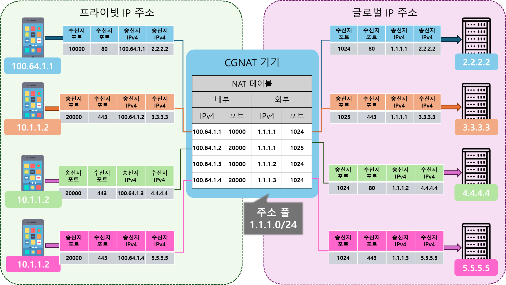

- 어떻게 할당하는가에 이어서 나올 3가지 방식으로 나뉜다.
- 할당 방식 결정 방법 : `집약효율` + `로그 출력량`

  - `집약효율` : 공인 IP 하나당 최대한 많은 가입자를 연결할 수 있는지
  - `로그 출력량` : 가입자를 특정하기 위한 로그 저장 비용과 성능

### 정적할당

- 가입자에게 미리 정한 수의 포트 번호를 정적으로 할당하는 방법
  - `여기부터 여기까지는 이 사용자가 사용한다`
- PBA나 동적할당에 비해 집약 효율이 낮지만 로그를 얻을 필요가 없어 비용 성능 절약함.

### PBA

- `PBA`(Part Block Allocation) : 가입자에게 지정한 포트 블록(포트 번호의 범위)을 동적으로 할당하는 방법
  - 정적 할당과 동적할당의 중간
- 정적할당에 비해 집약 효율이 높지만, 로그 얻어야 함.
- 동적할당이 비해 집약 효율이 낮지만, 로그 출력량 억제 가능.

### 동적할당

- 가입자에게 포트 번호를 동적으로 할당하는 방법
- 할당된 모든 포트번호를 유효하게 활용 => 집약 효율 ↑
- but, 그만큼 로그 저장 많이 해야함
  - 글로벌 IPv4 주소와 포트번호를 사용하고 있는지 전부 로그로 기록해야 하기 때문

### 정리

집약효율이 높을수록 로그 관리를 그만큼 해줘야해서 집약효율은 올라가지만 서버 비용이 증가한다.

### EIM/EIF 기능(풀 콘 NAT)

- `EIM`(Endpoint Independent Mapping) : 수신지가 달라도 같은 송신지 IP 주소와 송신지 포트번호를 가진 통신에는 일정 시간 동안 같은 전체 주소와 포트 번호를 계속 할당할 수 있는 기능.
- `EIF`(Endpoint Independent) : `EIM`에 따라 할당된 전체 주소와 포트번호에 대해 인바운드 커넥션(인터넷으로부터의 통신)을 일정 시간동안 받을 수 있는 기능.
- `EIM`과 `EIF`를 활성화한 NAT: **풀 콘 NAT**(full cone NAT)
- P2P 통신의 문제점 및 풀콘 NAT를 활용한 개선
  - 일반적인 NAT 환경에서는 사설 IP를 사용하는 단말끼리 직접 P2P 통신이 불가능
  - 실시간 P2P 연결이 필요한 서비스를 위해 풀콘 NAT 사용하여 일정 시간 동안 동일한 공인 IP/포트 매핑을 유지하기에 P2P 연결이 설정된 후에도 NAT에서 세션을 유지하여 재접속 가능하여 P2P 통신이 원활해져 온라인 게임, VoIP, WebRTC에서 지연 감소

### 헤어핀 NAT (hairpin NAT)

- 같은 CGNAT장치 아래 있는 가입자 단말 사이에서 글로벌 IPv4 주소를 통한 반환 통신을 구현하는 기능.
- `풀 콘 NAT`와 비슷하나, CGNAT 장치 아래 있는 단말 사이의 통신을 대상으로 한다는 차이점.

### 커넥션 리미트

- 1대의 가입 단말이 사용할 수 있는 포트 수 제한
- 포트도 결국 물리적 제한이 있어서 무한정 확장 불가.

## 4.5.4 NAT 트래버설(NAT 초월)

NAT 아래 단말은 private IP만 가지고 있기에 인터넷에 직접 통신 x.  
=> NAT기기를 뛰어넘어 단말끼리 직접 통신하도록 하기 위한 **NAT 트래버설**(NAT Traversal) 기술 사용.

### 1. 포트포워딩

- port forwarding : 특정 IP 주소/포트 번호에 대한 통신을 미리 설정해 둔 내부 단말로 전송
- lan에 있는 서버를 외부에 공개할 때 등 사용.
- ex.) docker

### 2. UPnP

- Universal Plug and Play : 단말로부터의 요청에 따라 자동으로 포트 포워딩.

### 3. STUN

- Session Traversal Utilities for NATs : USP 사용해 외부인터넷으로부터 외부 네트워크(LAN)에 대한 통신을 허가하는 기능.
  - `UDP 홀 펀칭`(UDP hole punching)
  - 소니 - PS4의 NAT 타입 판정 등에 사용

### 4 TURN

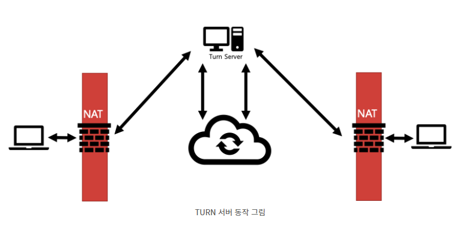

- Traversal Using Relay aroud NAT : TURN 서버를 통한 통신

### + ICE (Interactive Connectivity)

- client가 모든 통신 가능한 주소를 식별하는 것.
- client가 STUN 메시지를 TURN 서버로 요청 및 응답 과정에서 다음 3가지 주소를 확인
  - Relayed Address : TURN 서버가 패킷 릴레이를 위해 할당하는 주소

  
참고자료

  <a href="https://brunch.co.kr/@linecard/156#comment">30장. ICE의 이해</a>
  <a href="https://emong.tistory.com/140">NAT Traversal의 종결자, ICE</a>

# 4.6 IPV4와 IPV6의 공용 기술

두 규격의 간극을 메꾸기 위한 기술들

## 4.6.1 듀얼스택

- 하나의 기기에 IPv4주소와 IPv6 주소 모두 할당하는 기술
- 양쪽과 대응가능하지만, 그만큼 부하가 많아짐

## 4.6.2 DNS64/NAT64 (6장 읽고 다시 읽어볼 것)

- DNS 서버의 기능을 이용해 IPv6 단말이 IPv4 단말과 통신할 수 있도록 하는 기술.

### 실제 처리 흐름.

- IPv6단말이 '1.1.1.1'이라는 IPv4 주소를 가진 'www.example.com'에 액세스한다고 가정
  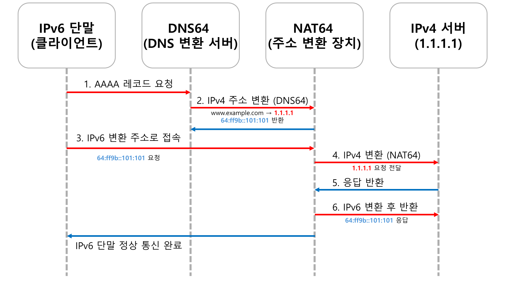

1. IPv6 단말이 www.example.com의 AAAA 레코드를 요청
2. DNS64 서버가 IPv4 주소(1.1.1.1)을 변환하여 64:ff9b::101:101을 반환
   - '64:ff9b::/96'은 DNS64용으로 예약되어 있는 네트워크
3. IPv6 단말이 변환된 주소(64:ff9b::101:101)로 접속
4. NAT64 장치가 IPv6 패킷을 받아 IPv4 변환 후 서버(1.1.1.1)로 전달
5. IPv4 서버가 응답을 보내면 NAT64가 다시 IPv6 패킷으로 변환
6. IPv6 단말이 응답을 받고 정상적인 통신 유지

## 4.6.3 터널링

### 실제 처리 흐름

- IPv4 단말이 IPv6 네트워크를 통해 IPv4 패킷을 송신하는 경우, 다시 말해 IPv4 over IPv6를 예로 들어 설명.

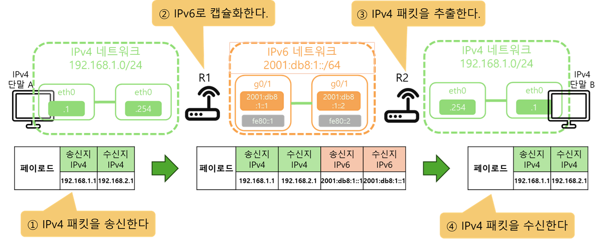

- IPv4 단말 A가 IPv4 패킷을 송신
- **R1(터널링 라우터)**에서 IPv4 패킷을 IPv6 패킷으로 캡슐화, **Ipv6 네트워크를 통해 R2(터널링 라우터)**까지 IPv6 패킷을 전송
- R2에서 IPv6 패킷을 디캡슐화해서 원래 IPv4 패킷을 복원
- IPv4 단말 B가 최종적으로 IPv4 패킷을 수신

- 135쪽에서 봤던 IPoE로 플렛츠 네트워크에 연결.
- IPoE에 추가된 형태로 책정된 연결 방식이므로 IPv4에 대응하지 않음.
- VNE(Virtual Network Enabler)가 제공한 라우터에 IPv4 Over IPv6의 터널을 만들고, 거기에 IPv4 네트워크로 연결

# 4.7 ICMPv4

- Internet Control Message Protocol version 4
- IPv4 네트워크에서 오류 보고 및 진단을 담당하는 프로토콜
- 네트워크 장비(라우터, 호스트 등) 간의 통신 문제를 감지하고 해결하는 데 사용
- 패킷 전달 중 발생하는 문제 감지 및 보고
- `ping`, `traceroute` 같은 네트워크 진단 도구에서 사용
- 라우팅 루프 방지 및 경로 최적화 지원

## 4.7.1 ICMPv4의 패킷 포맷

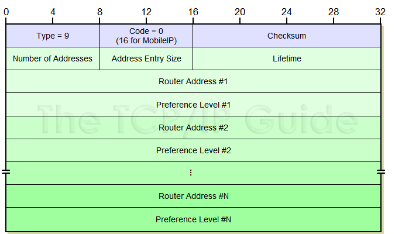

| 필드명         | 크기 (bit) | 설명                                                                        |
| -------------- | ------------- | --------------------------------------------------------------------------- |
| Type           | 8             | 메시지의 종류 (예: Echo Request, Destination Unreachable 등)                |
| Code           | 8             | 세부 유형 (예: 목적지 도달 불가 시 네트워크, 호스트, 프로토콜 등 세부 구분) |
| Checksum       | 16            | 오류 검출을 위한 체크섬                                                     |
| Rest of Header | 32            | 메시지 종류에 따라 달라지는 필드 (예: 식별자, 시퀀스 번호 등)               |

- **대표적인 ICMPv4 타입 코드**

<table border="1">
    <thead>
        <tr>
            <th>Type</th>
            <th>Code</th>
            <th>설명</th>
        </tr>
    </thead>
    <tbody>
        <tr>
            <td rowspan="1" style="text-align:center;">0</td>
            <td style="text-align:center;">0</td>
            <td>Echo Reply (에코 응답, <code>ping</code> 응답)</td>
        </tr>
        <tr>
            <td rowspan="3" style="text-align:center;">3</td>
            <td style="text-align:center;">0</td>
            <td>Destination Network Unreachable (네트워크 도달 불가)</td>
        </tr>
        <tr>
            <td style="text-align:center;">1</td>
            <td>Destination Host Unreachable (호스트 도달 불가)</td>
        </tr>
        <tr>
            <td style="text-align:center;">3</td>
            <td>Destination Port Unreachable (포트 도달 불가)</td>
        </tr>
        <tr>
            <td rowspan="2" style="text-align:center;">5</td>
            <td style="text-align:center;">0</td>
            <td>Redirect Datagram for Network (네트워크 리디렉션)</td>
        </tr>
        <tr>
            <td style="text-align:center;">1</td>
            <td>Redirect Datagram for Host (호스트 리디렉션)</td>
        </tr>
        <tr>
            <td rowspan="1" style="text-align:center;">8</td>
            <td style="text-align:center;">0</td>
            <td>Echo Request (에코 요청, <code>ping</code> 요청)</td>
        </tr>
        <tr>
            <td rowspan="2" style="text-align:center;">11</td>
            <td style="text-align:center;">0</td>
            <td>Time to Live Exceeded in Transit (TTL 초과, <code>traceroute</code> 사용 시 발생)</td>
        </tr>
        <tr>
            <td style="text-align:center;">1</td>
            <td>Fragment Reassembly Time Exceeded (단편 조립 시간 초과)</td>
        </tr>
    </tbody>
</table>

## 4.7.2 대표적인 ICMPv4의 동작

### 에코 요청/응답

- IP 레벨의 통신 상태를 확일할 때 사용되는 ICMPv4 패킷 (echo request / echo reply)
- 우리가 흔히 `ping` 명령어 사용 방식.

**🔹에코 요청**

<table border="1">
  <tr>
      <th colspan="2">에코요청</th>
      <th>프로토콜</th>
      <th>송신지 IP</th>
      <th>수신지 IP</th>
  </tr>
  <tr>
      <th>코드</th>
      <th>타입</th>
      <td rowspan="2">ICMP</td>
      <td rowspan="2">PC1</td>
      <td rowspan="2">PC2</td>
  </tr>
  <tr>
      <td>0</td>
      <td>8</td>
  </tr>
</table>

**🔹 에코 응답**

<table border="1">
  <tr>
      <th>프로토콜</th>
      <th>송신지 IP</th>
      <th>수신지 IP</th>
      <th colspan="2">에코응답</th>
  </tr>
  <tr>
      <td rowspan="2">ICMP</td>
      <td rowspan="2">PC1</td>
      <td rowspan="2">PC2</td>
      <th>코드</th>
      <th>타입</th>
  </tr>
  <tr>
      <td>0</td>
      <td>0</td>
  </tr>
</table>

### Destination Unreachable

- 목적지 도달 불가, ICMP Type 3
- 코드 : "파기한 이유"

| Code | 설명                                      |
| ---- | ----------------------------------------- |
| 0    | Network Unreachable (네트워크 도달 불가)  |
| 1    | Host Unreachable (호스트 도달 불가)       |
| 2    | Protocol Unreachable (프로토콜 도달 불가) |
| 3    | Port Unreachable (포트 도달 불가)         |

**🔹 목적지 도달 불가 패킷 포맷**

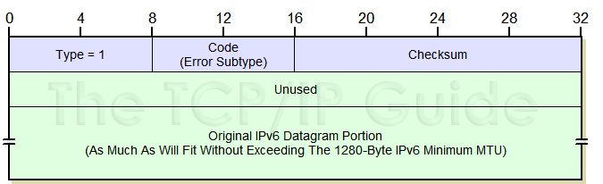

**🔹 동작 과정**

1. PC A가 PC B로 패킷을 전송
2. 네트워크 장비에서 전달이 불가능할 경우 ICMP Type 3 메시지 생성
3. 송신지(PC A)로 반환하여 네트워크 오류를 확인

### Time-to-live-exceeded

- IPv4 패킷의 TTL(Time to Live, 패킷 유효 기간)이 '0'이 되어 파기했을 때, 그것을 송신지 단말에게 알리는 패킷
- TTL Exceeded의 2가지 역할이 `라우팅 루피 방지` 와 `통신 경로 확인`

**라우팅 루프 방지**

- 네트워크 구성 그림을 통해 라우팅 루프와 TTL Exceeded의 발생 메커니즘을 설명
- **통신 경로 확인**

# 4.8 ICMPv6 (Internet Control Message Protocol version 6)

- IPv6 네트워크에서 오류 보고 및 진단을 담당하는 프로토콜
- IPv4의 ICMPv4와 유사한 역할을 하지만, 추가적으로 IPv6 주소 자동 설정, 네트워크 디스커버리(ND, Neighbor Discovery) 등의 기능도 포함.

## 4.8.0 ICMPv6의 역할

- IPv6 네트워크에서 오류 감지 및 보고
- IPv6 주소 자동 구성 및 경로 탐색
- 네트워크 상태 진단 (ping6, trace-route6)
- 라우팅 루프 방지 및 최적화

## 4.8.1 ICMPv6의 패킷 포맷

| 필드명       | 크기(비트) | 설명                                                                        |
| ------------ | ---------- | --------------------------------------------------------------------------- |
| Type         | 8          | 메시지의 종류 (예: Echo Request, Destination Unreachable 등)                |
| Code         | 8          | 세부 유형 (예: 목적지 도달 불가 시 네트워크, 호스트, 프로토콜 등 세부 구분) |
| Checksum     | 16         | 오류 검출을 위한 체크섬                                                     |
| Message Body | 가변       | 메시지의 내용 (예: Echo 요청의 ID 및 시퀀스 번호 등)                        |

**대표적인 ICMPv6 타입 코드**

<table border="1">
    <thead>
        <tr>
            <th>Type</th>
            <th>Code</th>
            <th>설명</th>
        </tr>
    </thead>
    <tbody>
        <tr>
            <td rowspan="6" style="text-align:center;">1</td>
            <td style="text-align:center;">0</td>
            <td>Destination Unreachable (목적지 도달 불가 - 일반 오류)</td>
        </tr>
        <tr>
            <td style="text-align:center;">1</td>
            <td>No Route to Destination (목적지 경로 없음)</td>
        </tr>
        <tr>
            <td style="text-align:center;">2</td>
            <td>Communication with Destination Prohibited (관리적으로 통신 금지)</td>
        </tr>
        <tr>
            <td style="text-align:center;">3</td>
            <td>Beyond Scope of Source Address (출발지 주소 범위를 벗어남)</td>
        </tr>
        <tr>
            <td style="text-align:center;">4</td>
            <td>Address Unreachable (목적지 주소에 도달할 수 없음)</td>
        </tr>
        <tr>
            <td style="text-align:center;">5</td>
            <td>Port Unreachable (목적지 포트에 도달할 수 없음)</td>
        </tr>
        <tr>
            <td style="text-align:center;" rowspan="1">2</td>
            <td style="text-align:center;">0</td>
            <td>Packet Too Big (패킷 크기 초과)</td>
        </tr>
        <tr>
            <td style="text-align:center;" rowspan="2">3</td>
            <td style="text-align:center;">0</td>
            <td>Time Exceeded in Transit (전송 중 TTL 초과)</td>
        </tr>
        <tr>
            <td style="text-align:center;">1</td>
            <td>Fragment Reassembly Time Exceeded (단편 조립 시간 초과)</td>
        </tr>
        <tr>
            <td style="text-align:center;" rowspan="1">128</td>
            <td style="text-align:center;">0</td>
            <td>Echo Request (에코 요청, ping6)</td>
        </tr>
        <tr>
            <td style="text-align:center;" rowspan="1">129</td>
            <td style="text-align:center;">0</td>
            <td>Echo Reply (에코 응답, ping6)</td>
        </tr>
    </tbody>
</table>

## 4.8.2 대표적인 ICMPv6의 동작

### IPv6 주소 중복 감지

- DAD (Duplicate ADdress Detection)
- **IPv6에서 주소 중복 감지가 필요한 이유**
  - IPv6에서는 DHCP서버 없이도 자동으로 주소를 설정할 수 있다. (SLAAC, Stateless Address Autoconfiguration)
  - But, 동일 네트워크 내 주소 중복 시 충돌이 가능하기에 방지차원에서 DAD 과정을 거친다.

### 실제 처리 흐름

- IPv6단말이 네트워크에 접속해 링크 로컬 주소가 설정되었을 때, 다시 말해 SLAAC나 DHCP로 IPv6 주소가 설정되기 전의 처리 설명.

1. 링크 로컬 주소 설정
   - 더미 링크주소 라고도 하며, fe80::/10이다.
2. 중복 주소 확인
   - 중복 확인 위해 ICMPv6의 타입 135인 NS(Neighbor Solicitation)패킷을 송신해서 확인.
     - 송신지 : `::/128(미지정주소)`
     - 수신지 : `ff02::1:ff`에 링크 로컬 주소의 하위 24비트 추가.
     - 현재 로컬 더미 링크 주소 : 페이로드 부분의 목표 주소 필드에 삽입입
3. 주소 충돌 여부 판단
   - case1 : 응답(NA 패킷)이 없다면
     - 사용가능하다고 판단, 실제 주소로 인터페이스에 설정
   - case2 : 응답이 있다면
     - 해당 주소를 이미 사용중인 장치가 있기에 136 타입인 NA 패킷이 돌아옴.
     - 이 경우, 시스템은 **새로운 주소를 설정해야 함** (SLAAC/DHCPv6 사용 가능).

| 단계 | 설명                                                                       |
| ---- | -------------------------------------------------------------------------- |
| 1    | 링크 로컬 주소 설정 fe80::/10 범위의 임시 링크 로컬 주소 자동 설정         |
| 2    | DAD 수행 (주소 충돌 확인) ICMPv6 Neighbor Solicitation (NS, 타입 135) 전송 |
| 3    | 주소 충돌 여부 판단 - 응답(NA)이 없으면 사용 가능 → 실제 IPv6 주소로 설정  |

### 수신지 IPv6 주소에서 수신지 MAC 주소 구하기

- 123쪽, 챕터 3데이터링크 - 3.3 ARP에서
  (송신지 MAC 주소/송신지 IPv4 주소
  ARP를 송신하는 단말의 MAC 주소와 IPv4 주소를 나타내는 가변 길이 필드
  목표 MAC 주소/목표 IPv4 주소
  ARP로 주소를 결정하려는 MAC 주소와 IPv4 주소를 나타내는 가변 길이 필드)
  라는 내용이 있었던 것 참조

  
ICMPv6에서의 TTL Exceeded

  <table border="1">
    <tr>
      <th>설명</th>
      <th>정상 라우팅</th>
      <th>라우팅 루프 & TTL 초과</th>
    </tr>
    <tr>
      <td>그림</td>
      <td>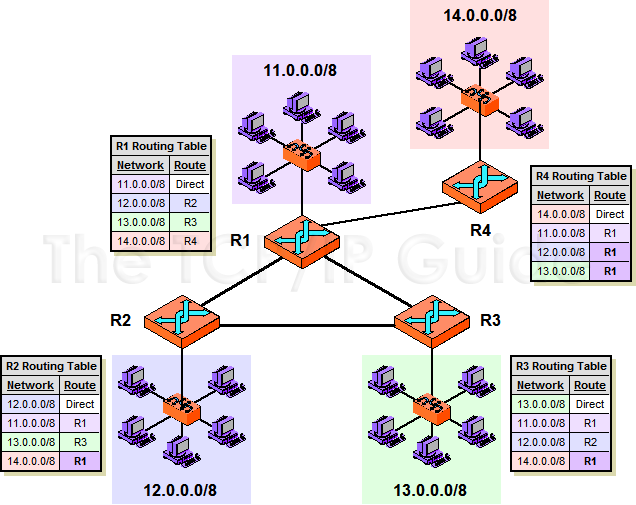</td>
      <td>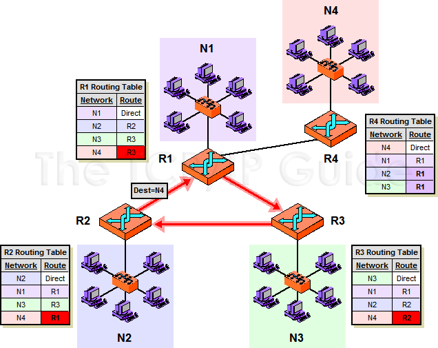</td>
    </tr>
    <tr>
      <td><b>라우팅 테이블 상태</b></td>
      <td>정상 (목적지로 연결됨)</td>
      <td>오류 (무한 루프 발생)</td>
    </tr>
    <tr>
      <td><b>패킷 이동 경로</b></td>
      <td>R1 → R2 → R3 → R4 → 목적지</td>
      <td>R1 → R3 → R2 → R1 (무한 루프)</td>
    </tr>
    <tr>
      <td><b>TTL 감소 과정</b></td>
      <td>TTL이 줄어들지만, 목적지 도착 전 도달</td>
      <td>TTL이 계속 줄어들다 <b>0이 되어 폐기됨</b></td>
    </tr>
    <tr>
      <td><b>ICMP 메시지 발생</b></td>
      <td>없음 (정상 라우팅)</td>
      <td>ICMP Time Exceeded (TTL 초과)</td>
    </tr>
    <tr>
      <td><b>traceroute 결과</b></td>
      <td>목적지까지 정상적으로 출력</td>
      <td><b>라우팅 루프가 반복됨</b></td>
    </tr>
  </table>

### 네트워크 정보 제공

# 4.9 IPsec

- Security Architecture for Internet Protocol
- 네트워크 계층에서 IP 패킷의 캡슐화나 인증, 암호화하고 인터넷상에 가상의 전용선(터널)을 만드는 가상화 기술.
- 주요역할
  - IP 패킷의 인증(Authentication)
  - 암호화(Encryption)
  - 무결성 보호(Integrity)
  - 재전송 방지(Anti-replay)

## 4.9.1 거점 간 VPN과 원격 액세스 VPN

### VPN이란?

- virtual private network
- 가상 사설망(VPN)은 사용자가 사설망에 연결된 것처럼 인터넷에 액세스할 수 있도록 하는 인터넷 보안 서비스

### 거점 간 IPsec VPN

- 여러 지점 간에 VPN을 구축하는 방식
- 회사 본사와 지사 간의 보안 통신을 위한 VPN 구축에 활용
- 전용선으로 물리적으로 연결하기에는 비용과 시간이 너무 많이 들어서
  - => 인터넷 상에 터널(가상 직결 회골)을 만들고, 거점 네트워크 연결.

**거점 간 VPN 동작 흐름**

1. 본사와 지사 라우터 사이에 IPsec 터널을 생성.
2. 터널을 통해 암호화된 트래픽만 전달.
3. 사내 네트워크 간 안전한 데이터 전송 가능.

### 리모트 액세스 IPsec VPN

- 개별 사용자가 외부에서 사내 네트워크에 접속할 수 있도록 하는 방식 (직원이 외부에서 회사 내부망에 접속할 때 사용됨)
- VPN 클라이언트가 VPN 서버(게이트웨이)에 접속하여 IPsec 터널을 생성
- 거점 간 VPN과 달리, 사용자 개별 접속을 지원

**리모트 액세스 VPN 동작 흐름**

1. 사용자가 VPN 클라이언트 소프트웨어를 실행하고 VPN 서버에 접속.
2. VPN 서버가 사용자를 인증하고 IPsec 터널을 설정.
3. IPsec 암호화된 패킷을 사용하여 내부 네트워크 접근 가능.

## 4.9.2 IPsec 프로토콜의 기능

### IKE (Internet Key Exchange)

**IKEv1**

1. phase1 : 터널 제어하는 ISAKMP SA(Internet Security Association and Key Management Protocol Security Association) 만들며, 이를 위해 설정의 합의나 암호키 공유, 접속 상대 인증 등 수행.
   1. 메인모드 : `설정합의` → `암호키 공유` → `연결 상대 인증`
   2. 어그레시브 모드 : 암호키 공유, 연결 상대 확인을 한 단계로 처리.
      - 연결까지 걸리는 시간은 짧지만
      - 인증정보가 암호화되지 않고 전달되기 때문에 메인모드에 비해 보안 레벨이 낮음.
2. phase2 : 실제 데이터를 교환하는 IPSec SA를 만든다.
   1. 퀵모드
      - phase1에서 만든 ISAKMP SA 상에서 IPsec SA를 만들기 위해 필요한 설정이나 암호키 공유
      - 상향 통신용과 하향 통신용의 IPsec 2개를 만든다.
      - 그 후에도 SIAKMP SA는 남아 암호키 교환 관리.

**IKEv2**

- IKEv1의 호환성 문제의 해결책
- 이미 일반화 됨.

1. **IKE_SA_INIT**
   - IKE SA(터널 제어 커넥션) 만드는 단계
   - phase1과 동일
2. **IKE_AUTH**
   - Child SA(실제 데이터 교환 터널) 만드는 단계
   - phase2와 동일

| 기능                          | **IKEv1**                                                                                                     | **IKEv2**                    |
| ----------------------------- | ------------------------------------------------------------------------------------------------------------- | ---------------------------- |
| **동작 모드**                 | 메인 모드(Main Mode) 어그레시브 모드(Aggressive Mode)                                                      | 단일 모드 (단순화됨)         |
| **협상 단계**                 | 2단계 (복잡함)                                                                                                | 1단계 (간소화)               |
| **VPN 연결을 위한 교환 패킷** | 많음 (최대 6개)                                                                                               | 적음 (최대 4개)              |
| **키 교환용 터널**            | 별도 터널(Phase 1) 필요                                                                                       | 키 교환 시 단일 SA 사용      |
| **데이터 송수신용 터널**      | 별도 터널(Phase 2) 필요                                                                                       | 단일 SA로 통합               |
| **내장된 NAT-T 지원**         | 미지원 (추가 설정 필요)                                                                                       | 지원 (기본 지원)             |
| **모바일 환경 지원**          | 미지원 (핸드오버 어려움)                                                                                      | 지원 (연결 유지 용이)        |
| **리플레이 방어**             | 가능                                                                                                          | 가능                         |
| **보안성**                    | 상대적으로 낮음                                                                                               | 더 강력한 보안 알고리즘 사용 |
| **관련 RFC**                  | RFC2407(DOI) RFC2408(ISAKMP) RFC2409(IKE) RFC3706(DPD, Dead Peer Detection) RFC3947(NAT 트래버설) | RFC7296                      |

참고 : [Cisco_ipsec_link](https://www.cisco.com/c/ko_kr/support/docs/security-vpn/ipsec-negotiation-ike-protocols/217432-understand-ipsec-ikev1-protocol.html#toc-hId--386274088)

**결론**

- IKEv1과 IKEv2는 서로 교환하는 정보에 큰 차이 없음
- 연결 공정 단순화 (by 교환 횟수 ↓ / 순서변경)

### ESP/AH

IKE로 사전 준비 완료 후 IPsec/ChildSA 상에서 데이터 전송 시작하는데 
이때 ESP(Encapsulating Security Payload) 또는 AH(Authentication Header) 중 하나의 프로토콜 사용.

- ESP : 암호화 O
- AH : 암호화
  - 데이터 암호화가 제한된 국가에서 사용하는 프로토콜 (ex. 중국)
- 나머지 터널링, 메시지 인증, 리플레이 공격 방어 기능들은 동일

**IPsec/ChildSA의 동작모드 2가지**

1. 터널 모드
   - 오리지널 IP 패킷을 한층 새로운 IP 헤더로 캡슐화하는 모드
   - 거점 간 IPsec VPN, 일반적인 리모트 액세스 IPsec VPN에서 사용
2. 트랜스포트 모드
   - 오리지널 IP 패킷에 터널용 헤더 삽입한 모드
   - 137쪽에 나온 L2TP over IPsec 등에서 사용

  
L2TP over IPsec

  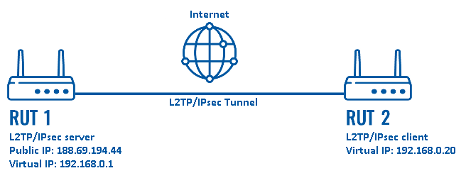

### IKEv1, IKEv2, ESP, AH 기능 비교표

| 기능               | 설명                                 | IKEv1 | IKEv2 | ESP | AH  |
| ------------------ | ------------------------------------ | :---: | :---: | :-: | :-: |
| 키 교환 기능       | 안전한 통신을 위해 암호화 키를 교환  |   O   |   O   |  X  |  X  |
| 상대방 인증 기능   | VPN 장비 간 상호 인증 수행           |   O   |   O   |  X  |  X  |
| 터널 기능          | IP 패킷을 감싸서 보호 (터널링)       |   X   |   X   |  O  |  O  |
| 암호화 기능        | 데이터를 암호화하여 기밀성 보장      |   X   |   X   |  O  |  X  |
| 메시지 인증 기능   | 패킷 변조 방지 및 무결성 검증        |   X   |   X   |  O  |  O  |
| 리플레이 방어 기능 | 패킷 재전송 공격(Replay Attack) 방어 |   O   |   O   |  O  |  O  |
| NAT-Traversal 지원 | NAT 환경에서도 VPN 터널 유지         |   X   |   O   |  X  |  X  |
| 모바일 환경 최적화 | 끊김 없이 VPN 유지                   |   X   |   O   |  X  |  X  |

### NAT Traversal (NAT-T)

- NAT(Network Address Translation) 환경에서 IPsec을 원활하게 동작하도록 지원하는 기능
- 일반적으로 NAT 환경에서 IPsec VPN 동작 안함

**왜 안되는가?**

- AH 프로토콜이 NAT와 호환되지 않음
  - NAT가 IP 헤더를 변경하면 AH의 무결성 검증이 실패함.
- ESP 프로토콜이 포트 번호 없이 전송됨
  - NAT가 다수의 클라이언트를 구분할 수 없음.
- IPsec은 기본적으로 NAT를 고려하지 않음
  - NAT 환경에서 VPN 연결이 끊어질 수 있음.

**어떻게 해결했는가?**

- NAT-T를 사용하면 가능.
  1. IKE 협상에서 NAT 존재 여부 확인
  2. ESP 패킷을 UDP(포트 4500)로 캡슐화
  3. VPN 서버가 UDP 헤더를 제거하고 ESP 패킷 복원
  4. VPN 트래픽이 정상적으로 NAT를 통과하여 암호화된 데이터 전송 가능

---

## 참고 자료

https://www.purevpn.com/kr/blog/what-is-cgnat/
https://aws.amazon.com/ko/what-is/ipsec/
https://aws.amazon.com/ko/what-is/vpn/
http://www.tcpipguide.com/free/t_IPSecurityIPSecProtocols.htm
https://wiki.teltonika-networks.com/view/L2TP_over_IPsec